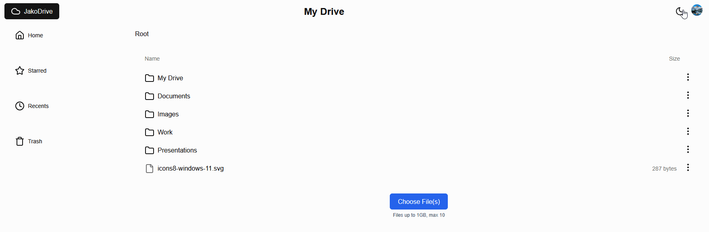

# JakoDrive 🚀
**A Next.js-powered cloud storage solution with real-time file management, authentication, and seamless uploads.**

Developed a scalable cloud storage solution that enables users to securely store, organize, and manage their files in the cloud. The solution uses a modern, type-safe tech stack for efficient file management, featuring real-time updates and seamless file organization.

## 🌐 Live Demo
[https://jakodrive.netlify.app/](https://jakodrive.netlify.app/)  

## ✨ Features

- 🔐 Secure Authentication using Clerk
- 📁 Intuitive folder and file management
- ⭐ File starring/favoriting system
- 📤 Drag-and-drop file uploads via UploadThing
- 🌓 Dark/Light theme support
- 📱 Responsive design for mobile and desktop
- 🔄 Real-time updates
- 📊 File size tracking and management
- 🗂️ Hierarchical folder structure
- 🔍 Breadcrumb navigation

## 🛠️ Tech Stack

### Frontend

- **Next.js** - React framework with App Router for server-side rendering and routing
- **Tailwind CSS** - Utility-first CSS framework for efficient UI development
- **ShadCN** - Customizable component library using Radix UI and Tailwind CSS
- **Lucide Icons** - Modern icon set
- **next-themes** - Theme management

### Backend

- **SingleStore** - Distributed SQL database
- **Drizzle ORM** - TypeScript ORM
- **Clerk** - Authentication and user management
- **UploadThing** - File upload and storage service
- **Zustand** - State management

### Development Tools

- **TypeScript** - Static type checking, ensures type safety
- **ESLint** - Code linting
- **Prettier** - Code formatting
- **PostHog** - Product analytics

## 🚀 Getting Started

1. Clone the repository
2. Install dependencies: `npm install`
3. Set up environment variables (see `.env.example`)
4. Run the development server: `npm run dev`
5. Open [http://localhost:3000](http://localhost:3000)

## 📝 Environment Variables

Required environment variables:

- `SINGLESTORE_*` - SingleStore database credentials
- `CLERK_*` - Clerk authentication keys
- `UPLOADTHING_TOKEN` - UploadThing API token
- `NEXT_PUBLIC_POSTHOG_*` - PostHog analytics keys

